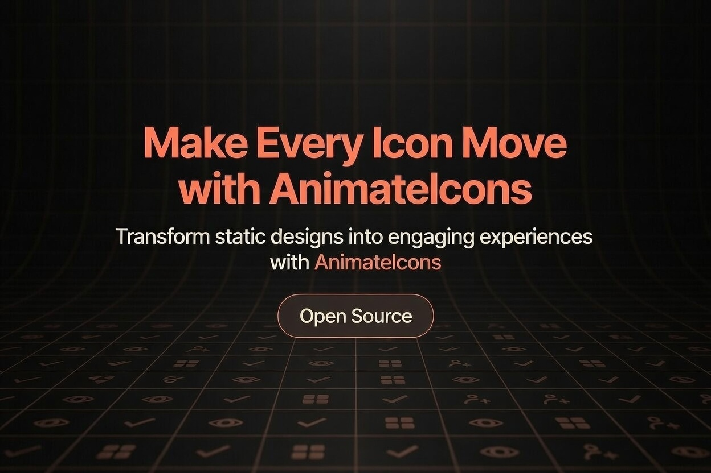

<div align="center">

# AnimateIcons

**Free, open-source animated SVG icons for React.**
Drop-in components built on `motion/react`. Hover and imperative animation triggers, configurable size, color, and duration. Installed one icon at a time via the shadcn CLI.

[](./LICENSE)
[](https://animateicons.in/icons/lucide)
[](https://animateicons.in/icons/huge)
[](https://nextjs.org)
[](https://motion.dev)

[**Browse icons →**](https://animateicons.in/icons/lucide) &nbsp;·&nbsp; [**Docs →**](https://animateicons.in/icons/docs) &nbsp;·&nbsp; [**Sponsor →**](https://github.com/sponsors/Avijit07x)



</div>

---

## Why AnimateIcons

Most icon libraries are static SVGs. AnimateIcons gives you the same icon coverage, but each one is a **self-contained React component** with motion baked in:

- **Hover animation by default** — drop one in and it just works.
- **Imperative API** — drive animations from refs (`startAnimation()` / `stopAnimation()`) for click, focus, scroll, or any custom trigger.
- **No runtime dependency on us** — the shadcn CLI copies the source into your project. Your icons, your bundle.
- **Respects `prefers-reduced-motion`** — accessibility is automatic, not a setting.
- **Tailwind & shadcn friendly** — works with `currentColor`, theme tokens, and CSS variables out of the box.

---

## Quick start

### 1. Set up shadcn/ui

```bash
pnpm dlx shadcn@latest init
```

Already have shadcn? Skip to step 2.

### 2. Install an icon

```bash
# pnpm
pnpm dlx shadcn@latest add https://animateicons.in/r/lu-bell-ring.json

# npm
npx shadcn@latest add https://animateicons.in/r/lu-bell-ring.json

# bun
bunx --bun shadcn@latest add https://animateicons.in/r/lu-bell-ring.json
```

Browse the full set at **[animateicons.in](https://animateicons.in/icons/lucide)** — every tile has a one-click copy button.

### 3. Use it

```tsx
import { BellRingIcon } from "@/components/ui/bell-ring";

export default function Notifications() {
  return <BellRingIcon size={24} color="#f45b48" />;
}
```

That's it. Hover it. The icon animates.

---

## Features

| Feature | What you get |
|---|---|
| **281 icons** | 248 Lucide-style + 33 Huge-style, growing every release |
| **Hover animation** | On by default, no setup |
| **Imperative API** | Refs expose `startAnimation()` / `stopAnimation()` |
| **Color prop** | `<Icon color="#f45b48" />`, also Tailwind `text-*` classes work |
| **Duration prop** | Multiplier — `duration={1.5}` = 1.5x slower |
| **Disable per icon** | `isAnimated={false}` |
| **Reduced motion** | Automatically respects OS setting |
| **TypeScript-first** | Per-icon `*Handle` types for refs |
| **Live playground** | [animateicons.in](https://animateicons.in/icons/lucide) — click any icon to tweak it |
| **MDX docs** | [/icons/docs](https://animateicons.in/icons/docs) |
| **URL-synced search** | Shareable filtered links — `/icons/lucide?q=bell` |
| **SEO-optimized** | Per-page metadata, JSON-LD structured data, sitemap |

---

## Props & types

```ts
interface IconProps {
  // Visual
  size?: number;          // default 24
  color?: string;         // any CSS color: hex, rgb, hsl, var(--token)
  className?: string;

  // Animation
  duration?: number;      // default 1 — multiplier (0.5 = 2x faster)
  isAnimated?: boolean;   // default true — false disables hover animation

  // DOM
  onMouseEnter?: (e: React.MouseEvent<HTMLDivElement>) => void;
  onMouseLeave?: (e: React.MouseEvent<HTMLDivElement>) => void;
  style?: React.CSSProperties;
}

// Imperative handle exposed via ref
interface IconHandle {
  startAnimation: () => void;
  stopAnimation: () => void;
}
```

Each icon also exports its own named handle type (`BellRingIconHandle`, `EyeIconHandle`, etc.) for refs.

---

## Examples

### Color & styling

```tsx
// 1. Color prop — sets currentColor inline
<EyeIcon color="#f45b48" />

// 2. Tailwind utility — works because icons use stroke="currentColor"
<EyeIcon className="text-primary" />

// 3. CSS variable — for themed designs
<EyeIcon style={{ color: "var(--brand)" }} />
```

### Animation control

```tsx
// Default: hover to animate
<EyeIcon size={28} />

// Slow down (or speed up) with duration multiplier
<EyeIcon size={28} duration={1.5} />

// Disable hover animation entirely
<EyeIcon size={28} isAnimated={false} />
```

### Imperative API

```tsx
"use client";
import { useRef } from "react";
import { EyeIcon, type EyeIconHandle } from "@/components/ui/eye";

export default function Demo() {
  const ref = useRef<EyeIconHandle>(null);

  return (
    <button
      onMouseEnter={() => ref.current?.startAnimation()}
      onMouseLeave={() => ref.current?.stopAnimation()}
      className="cursor-pointer"
    >
      <EyeIcon ref={ref} size={28} duration={1} />
    </button>
  );
}
```

### Reduced motion

All icons respect `prefers-reduced-motion`. When the user has it enabled, hover and imperative play become no-ops automatically — you don't need to do anything.

---

## Project structure

```
animateicons/
├── icons/
│   ├── lucide/          ← 248 Lucide-style icons
│   └── huge/            ← 33 Huge-style icons
├── app/
│   ├── icons/
│   │   ├── [library]/   ← /icons/lucide, /icons/huge
│   │   └── docs/        ← MDX-powered install guide
│   └── (home)/          ← landing
├── components/          ← shared UI primitives
├── hooks/               ← useIconFilter, useIconAnimation
├── tests/               ← Vitest + RTL
└── scripts/             ← icon-list codegen, codemods
```

---

## Local development

```bash
git clone https://github.com/Avijit07x/animateicons.git
cd animateicons
pnpm install
pnpm dev
```

The dev server runs the gallery locally at `http://localhost:3000`.

### Scripts

```bash
pnpm dev          # gallery dev server (Turbopack)
pnpm build        # production build
pnpm test         # vitest run
pnpm typecheck    # tsc --noEmit
pnpm lint         # next lint
pnpm gen:icons    # regenerate the public/r/*.json registry
```

---

## Contributing new icons

We welcome PRs that add icons to either library. Each icon is a single React component file following the same template — copy any existing icon and adapt the SVG paths and motion variants.

See **[CONTRIBUTING.md](./CONTRIBUTING.md)** for the full workflow:

1. Create `icons/<library>/<name>-icon.tsx` from an existing icon as a template
2. Register it in `icons/<library>/index.ts`
3. Run `pnpm gen:icons` to regenerate the registry
4. Open a PR against `dev`

---

## Roadmap

Open issues and PRs welcome. High-level:

- More icon libraries (Phosphor-style, Tabler-style)
- Animation type taxonomy (filter by spin / pulse / morph / draw)
- Per-icon detail pages with live playground
- Storybook visual regression suite

---

## License

[MIT](./LICENSE) — use it however you want, in any project, commercial or otherwise.

If AnimateIcons saves you time, consider [sponsoring the project](https://github.com/sponsors/Avijit07x) so it keeps growing.

---

<div align="center">

Built with [Next.js](https://nextjs.org), [motion/react](https://motion.dev), and [shadcn/ui](https://ui.shadcn.com).

**[animateicons.in](https://animateicons.in)** &nbsp;·&nbsp; [GitHub](https://github.com/Avijit07x/animateicons)

</div>
